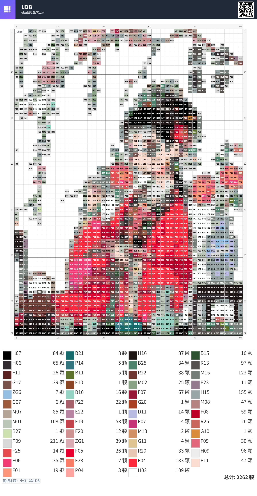
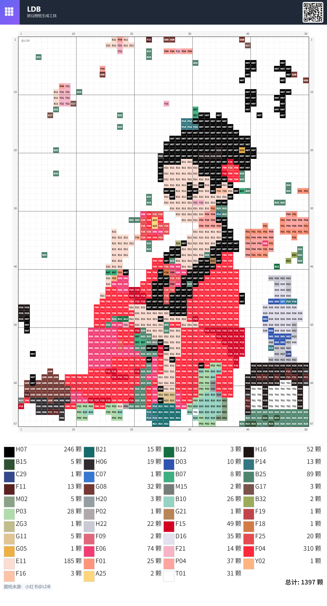
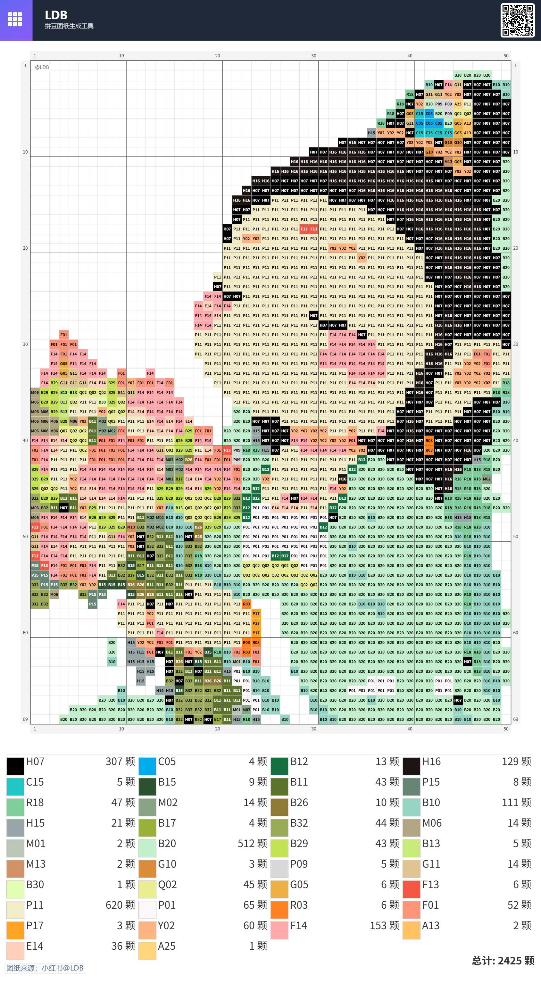
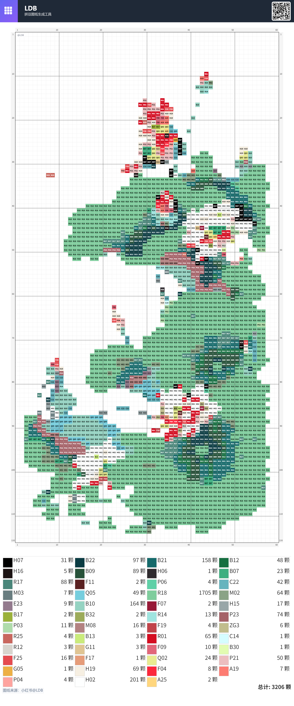

# 拼豆底稿生成器 (Perler Beads Generator)

因为市面上的拼豆软件差强人意 ，所以我基于开源项目：https://github.com/Zippland/perler-beads ， 我加上AI优化了项目，AI辅助优化图片功能，写了一个专门生成拼豆图纸的网站。 经过大量测试，我觉得已经可以达到 一键生成拼豆图纸了！

## 展示案例

核心就是： ai制作图纸  ，关键就是颜色尽可能少，颗粒尽可能少，各种各样图纸风格都兼容，同时表达尽可能清楚，这就是我的ai能够做到。









 
❓
想解决的（市场上拼豆软件的）问题：
1. 颜色识别不准确，
2. 灰色毛状边界线，
3. 无法自适应合并同色系的颜色，
4. 手动着色困难，无法精准选择颜色，
5. 无法给出采购清单，
6. 限制图片的导出和打印。

💯
目前（网站上的）功能：
1.  生成底稿，
2.  对应多种色号系统（MARD、COCO、漫漫、盼盼、咪小窝），
3.  多种解析风格选择（池化逻辑），
4.  自动合并邻近相似颜色，
5.  统计每个颜色/一共有多少粒，
6.  半自动去除杂色，
7.  细节部分的手动着色（或修改），
8.  橡皮擦功能，
9.  颜色替换功能，
10. 自定义调色板编辑器，
11. 悬浮调色盘和工具栏，
12. 放大镜工具，
13. 图片裁剪功能，
14. AI优化功能，
15. 导出图纸（支持多种格式和设置），
16. 导出采购清单（支持CSV格式），
17. 专心拼豆模式。

❤️ 如果有需求可以直接提，我集成在网站里。

✅
对于商家，我把算法的改进思路放在这里，
希望你们可以越做越好。
如果有其他想二开的同学，可以直接在项目提交pr，
这个思路也可以直接使用̋(ˊ•͈ꇴ•͈ˋ)

### 1️⃣ 初始颜色映射
黑色毛边是因为池化过程中对RGB 采用了 mean 操作，改为局部  max pooling ，每个单元，找到像素频率最高的 RGB 值，用欧氏距离查找最近的颜色就行

### 2️⃣ 区域颜色合并
杂色问题的产生，是因为没有进行颜色合并操作，需要从未访问单元格开始，使用BFS 查找欧氏距离小于阈值的邻近单元格，形成区域。将整个区域统一设置为该区域内出现次数最多的色号对应的颜色即可。

### 3️⃣ 背景移除
无法进行拼豆数量统计的原因，是没有进行背景移除操作：先定义背景色号列表。从图像所有边界单元格开始执行洪水填充。将所有与边界连通且颜色属于背景色号列表的单元格标记为"外部"。统计和下载时将忽略这些"外部"单元格即可。

### 4️⃣ 颜色排除与重映射
这是杂色自动去除仍不干净的情况下的附加功能，首先确定图像处理后最初包含的所有已存在颜色。重映射时，仅在已存在颜色中排除和其他已排除颜色的子集里寻找替换色。

## 功能特点

*   **图片上传**: 支持拖放或点击选择 JPG/PNG 图片。
*   **智能像素化**:
    *   **可调粒度**: 通过滑块控制像素画的横向格子数量。
    *   **颜色合并**: 通过滑块调整相似颜色的合并阈值，平滑色块区域。
    *   **多种解析风格**: 支持不同的池化逻辑，适应不同类型的图片。
*   **多色板支持**:
    *   提供多种预设拼豆色板 (如 168色, 144色, 96色等) 可供选择。
    *   **多种色号系统**: 支持 MARD、COCO、漫漫、盼盼、咪小窝等多种色号系统。
    *   **自定义调色板**: 允许用户创建和编辑自己的调色板。
*   **颜色排除与管理**:
    *   在颜色统计列表中点击可**排除/恢复**特定颜色。
    *   排除颜色后，原使用该颜色的区域将智能重映射到邻近的可用颜色。
    *   提供一键恢复所有排除颜色的功能。
*   **实时预览**:
    *   即时显示处理后的像素画预览。
    *   **悬停/长按交互**: 在预览图上悬停（桌面）或长按（移动）可查看对应单元格的颜色编码 (Key) 和颜色。
    *   自动识别并标记外部背景区域（预览时显示为浅灰色）。
    *   **放大镜工具**: 支持局部放大查看细节。
*   **手动编辑工具**:
    *   **手动着色模式**: 允许用户直接在预览图上修改颜色。
    *   **橡皮擦功能**: 可以擦除不需要的颜色。
    *   **颜色替换功能**: 可以批量替换特定颜色。
*   **高级功能**:
    *   **图片裁剪**: 支持上传前裁剪图片。
    *   **AI优化**: 提供AI辅助优化功能，将普通图片转换为适合拼豆的像素风格。
    *   **悬浮调色盘和工具栏**: 方便用户操作。
    *   **专心拼豆模式**: 提供沉浸式拼豆体验。
*   **下载成品**:
    *   **带 Key 图纸**: 下载带有清晰颜色编码 (Key) 和网格线的 PNG 图纸，忽略外部背景。
    *   **颜色统计图**: 下载包含各颜色 Key、色块、所需数量的 PNG 统计图。
    *   **CSV格式导出**: 支持导出采购清单为 CSV 格式。
    *   **多种下载设置**: 可调整网格线、坐标、单元格编号等选项。

## 技术实现

*   **框架**: [Next.js](https://nextjs.org/) (React) 与 TypeScript
*   **样式**: [Tailwind CSS](https://tailwindcss.com/) 用于响应式布局和样式。
*   **核心逻辑**: 浏览器端 [Canvas API](https://developer.mozilla.org/en-US/docs/Web/API/Canvas_API) 用于图像处理、颜色分析和绘制。
*   **状态管理**: React Hooks (`useState`, `useRef`, `useEffect`, `useMemo`)。
*   **组件架构**: 模块化组件设计，包括：
    *   `PixelatedPreviewCanvas`: 像素化预览画布
    *   `CustomPaletteEditor`: 自定义调色板编辑器
    *   `FloatingColorPalette`: 悬浮调色盘
    *   `FloatingToolbar`: 悬浮工具栏
    *   `MagnifierTool`: 放大镜工具
    *   `ImageCropperModal`: 图片裁剪弹窗
    *   `AIOptimizeModal`: AI优化弹窗
    *   `DonationModal`: 打赏弹窗
*   **本地存储**: 使用 `localStorage` 存储用户的调色板选择和设置。
*   **颜色系统**: 支持多种色号系统的映射和转换。

## AI功能详解

### 功能原理

AI功能基于火山引擎的即梦AI (Jimeng AI) 模型，通过以下步骤实现图片优化：

1.  **图像预处理**: 将用户上传的图片压缩到合适尺寸（最大2048x2048），并转换为Base64格式。
2.  **AI模型调用**: 使用预定义或用户自定义的提示词 (Prompt) 调用AI模型，将图片转换为适合拼豆的风格。
3.  **结果处理**: 接收AI生成的图片，进行后处理并返回给用户。

### 核心技术

1.  **提示词工程**: 使用精心设计的默认提示词，确保生成的图片具有以下特点：
    - Chibi画风（可爱风格）
    - 白底背景
    - Pixel art风格（像素艺术）
    - 16位复古游戏美学
    - 清晰的焦点和高对比度
    - 干净的线条和详细的像素艺术

2.  **API集成**: 通过火山引擎的API进行AI模型调用，包括：
    - 任务提交 (`CVSync2AsyncSubmitTask`)
    - 任务状态查询 (`CVSync2AsyncGetResult`)
    - 签名生成和认证

3.  **异步处理**: 由于AI生成需要时间，采用轮询机制等待任务完成，最长等待时间约3分钟。

4.  **错误处理**: 完善的错误处理机制，包括：
    - 图片风险检测（确保内容安全）
    - API调用错误处理
    - 任务超时处理

### 使用流程

1.  **上传图片**: 用户上传需要优化的图片。
2.  **打开AI优化弹窗**: 点击AI优化按钮，打开优化设置弹窗。
3.  **配置参数**: 
    - 可选择使用默认提示词或输入自定义提示词。
    - 点击"开始优化"按钮。
4.  **等待处理**: 系统显示处理进度，用户需要等待AI生成完成。
5.  **应用结果**: AI生成完成后，用户可以预览结果并选择是否应用到当前项目。

### 应用场景

1.  **风格转换**: 将普通照片转换为像素艺术风格，更适合拼豆制作。
2.  **简化复杂图像**: 自动简化复杂图像，突出主要元素，减少颜色数量。
3.  **背景处理**: 自动将复杂背景替换为白色，减少拼豆数量和复杂度。
4.  **创意增强**: 通过自定义提示词，用户可以尝试不同的艺术风格和效果。

### 技术实现

AI功能的实现涉及以下文件：

-   **前端实现**: `src/components/AIOptimizeModal.tsx` - AI优化弹窗组件
-   **核心工具**: `src/utils/aiOptimize.ts` - AI优化相关工具函数
-   **后端API**: `src/app/api/ai-optimize/route.ts` - 调用火山引擎API的后端接口

### 优势

1.  **智能化处理**: 利用AI技术自动处理图片，减少用户手动操作。
2.  **风格统一**: 生成的图片具有统一的像素艺术风格，更适合拼豆制作。
3.  **节省时间**: 快速将普通图片转换为适合拼豆的格式，节省用户设计时间。
4.  **灵活性**: 支持自定义提示词，满足用户的个性化需求。

### 注意事项

1.  **内容安全**: 系统会对图片进行风险检测，确保内容符合安全标准。
2.  **处理时间**: AI生成需要一定时间（通常1-2分钟），请耐心等待。
3.  **网络连接**: 需要稳定的网络连接以确保API调用成功。
4.  **API限制**: 基于火山引擎API的使用限制，可能存在调用频率限制。

### 核心算法：像素化、颜色映射与优化

应用程序的核心是将图像转换为像素网格，并将颜色精确映射到有限的拼豆调色板，同时进行平滑和背景处理。

1.  **图像加载与网格划分**:
    *   加载用户上传的图片。
    *   根据用户选择的"粒度"(`granularity`, N) 和原图宽高比确定 `N x M` 的网格尺寸。

2.  **初始颜色映射 (基于主导色)**:
    *   遍历 `N x M` 网格。
    *   对每个单元格，在原图对应区域内找出出现频率最高的**像素 RGB 值 (Dominant Color)**（忽略透明/半透明像素）。
    *   使用**欧氏距离**在 RGB 空间中，将该主导色映射到**当前选定且未被排除**的调色板 (`activeBeadPalette`) 中最接近的颜色。
    *   记录每个单元格的初始映射色号和颜色 (`initialMappedData`)。

3.  **区域颜色合并 (基于相似度)**:
    *   使用**广度优先搜索 (BFS)** 遍历 `initialMappedData`。
    *   识别颜色相似（欧氏距离小于 `similarityThreshold`）的**连通区域**。
    *   找出每个区域内出现次数最多的**珠子色号**。
    *   将该区域内所有单元格统一设置为这个主导色号对应的颜色，得到初步平滑结果 (`mergedData`)。

4.  **背景移除 (基于边界填充)**:
    *   定义一组背景色号 (`BACKGROUND_COLOR_KEYS`, 如 T1, H1)。
    *   从 `mergedData` 的**所有边界单元格**开始，使用**洪水填充 (Flood Fill)** 算法。
    *   标记所有从边界开始、颜色属于 `BACKGROUND_COLOR_KEYS` 且相互连通的单元格为"外部背景" (`isExternal = true`)。

5.  **颜色排除与重映射**:
    *   当用户排除某个颜色 `key` 时：
        *   确定一个**重映射目标调色板**：包含网格中**最初存在**的、且**当前未被排除**的所有颜色。
        *   如果目标调色板为空（表示排除此颜色会导致没有有效颜色可用），则阻止排除。
        *   否则，将 `mappedPixelData` 中所有使用 `key` 的非外部单元格，重新映射到目标调色板中的**最近似**颜色。
    *   当用户恢复颜色时，触发完整的图像重新处理流程（步骤 1-4）。

6.  **生成预览图与下载文件**:
    *   **预览图**: 在 Canvas 上绘制 `mergedData`，根据 `isExternal` 状态区分内部颜色和外部背景（浅灰），并添加网格线。支持悬停/长按显示色号。
    *   **带 Key 图纸下载**: 创建临时 Canvas，绘制 `mergedData` 中非外部背景的单元格，填充颜色、绘制边框，并在中央标注颜色 Key。
    *   **统计图下载**: 统计 `mergedData` 中非外部背景单元格的各色号数量，生成包含色块、色号、数量的列表式 PNG 图片。

### 调色板数据

预设的拼豆调色板数据定义在 `src/app/colorSystemMapping.json` 文件中，该文件包含了所有颜色的hex值到各个色号系统（MARD、COCO、漫漫、盼盼、咪小窝）的映射关系。不同的色板组合 (如 168色、96色等) 在 `src/app/page.tsx` 的 `paletteOptions` 中定义。

## 本地开发

1.  克隆项目:
    ```bash
    git clone https://github.com/liangdabiao/perler-beads-ai.git
    cd perler-beads
    ```
2.  安装依赖:
    ```bash
    npm install
    # or yarn install or pnpm install
    ```
3.  启动开发服务器:
    ```bash
    npm run dev
    # or yarn dev or pnpm dev
    ```
4.  在浏览器中打开 `http://localhost:3000`。

## 部署

该项目可以轻松部署到 [Vercel](https://vercel.com/) 等支持 Next.js 的平台。

## 未来可能的改进

*   **颜色映射算法**: 探索如 K-Means 聚类或使用 CIEDE2000 (Delta E) 颜色距离进行映射，可能获得更优的视觉效果（但计算成本更高）。
*   **抖动 (Dithering)**: 添加抖动选项（如 Floyd-Steinberg），在有限调色板下模拟更丰富的颜色过渡。
*   **性能优化**: 对非常大的图片或高粒度设置，考虑使用 Web Workers 进行后台计算。
*   **更多导出格式**: 支持导出为 PDF、SVG 等格式，以满足不同用户的需求。
*   **批量处理**: 支持批量上传和处理多张图片。
*   **模板库**: 提供预设的拼豆模板库，方便用户直接使用。
*   **社区功能**: 允许用户分享自己创建的拼豆设计。
*   **移动应用**: 开发配套的移动应用，提供更便捷的使用体验。
*   **更多色号系统**: 支持更多品牌和地区的拼豆色号系统。

## 许可证

Apache 2.0
